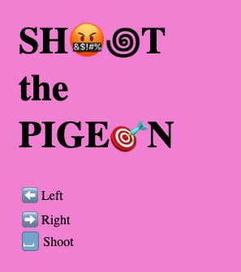

# Shoot the pigeon

A "shoot 'em all" game built in vanilla javascript, html and css.

A perfect way to improve programmig fundamental skills like OOP, DOM manipulation, loops and more... 

 

## How to play

Move the caracter right and left using arrow keys, and shoot with the spacebar.

Up level making points.

Dodge obstacles to stay alive.

 

## Demo

Check it out!! 

## [PLAY!](https://aleale81.github.io/Game-project1/)

